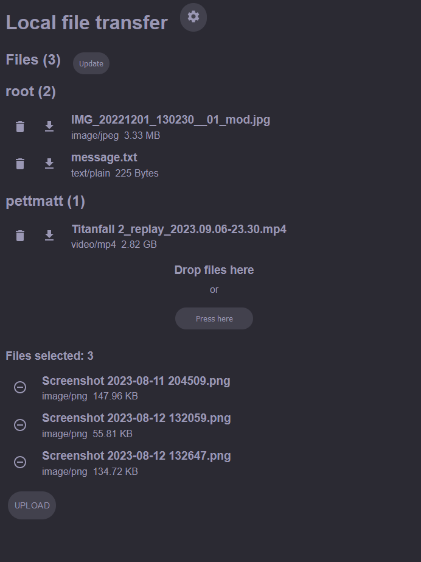

# About

In its core "Local file transfer application" or LFT is a REST server that allows users to move files between devices that are in the same network using a browser. User can create their own web interface and modify the server itself, but in order to use the server they need to host it somewhere, locally hosted is the recomended way to go. You can either donwload the binaries or build the server and the interface yourself. More detailed instructions can be found in `file-transfer-server` and `web-interface` directories.

## Is the application perfect?

No. There is multiple things that could be improved, for example PWA-application as the interface could improve user experience and the server could be more secure, which could enable it to be used in greater scale. At the moment this application is recommended to be used in smaller scale where couple of people share their files between reasonable amount of devices.
