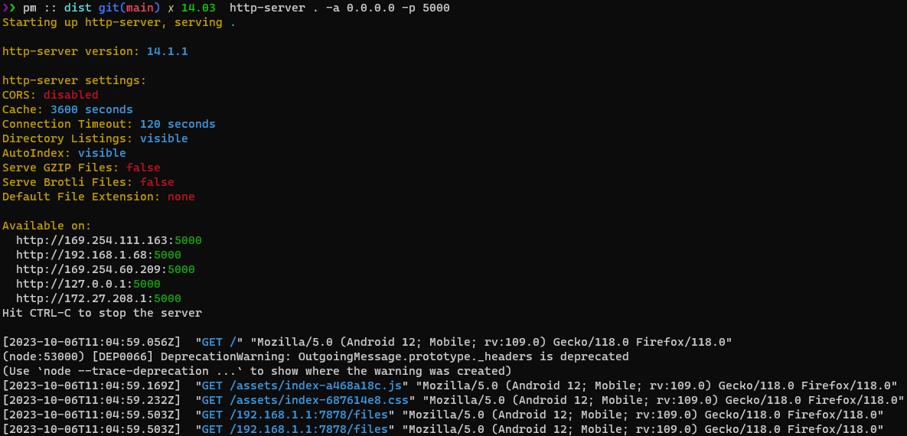

# Instructions

## Starting the web interface

At the moment of writing there's no option to use a web interface that is hosted online. Which is why you need to download the "ready to use" version, which can be found from [Github in the releases section](https://github.com/pettmatt/local-file-transfer). The "ready to use" version includes `html` (and other files), that need to be served using HTTP server. Personally I used `http-server` to test the setup.

